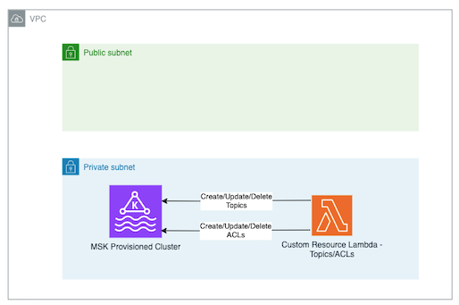
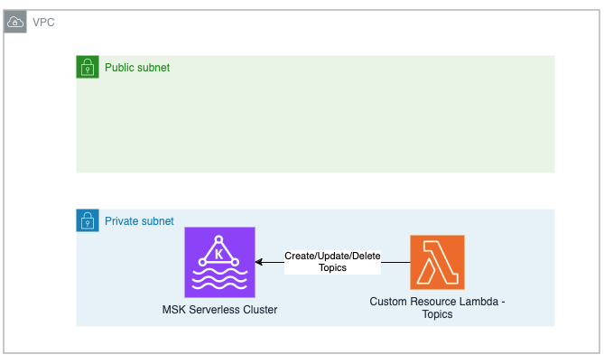

[//]: # (streaming.msk-provisioned)
# MSK Provisioned

An MSK Provisioned cluster with helpers to manage topics, ACLs and IAM permissions.

## Overview

The construct creates an MSK Serverless Cluster, with the latest Kafka version in MSK as default. You can change the dafaults by passing your own parameters as a Resource property to construct initializer. The construct support creating clusters with mTLS, IAM or both as authentication methods. The construct use IAM as authentication method if none is provided. It is also methods to manage topics and ACLs. Last, it also provides methods to grant an existing principal (ie IAM Role or IAM User or CN -Common Name-) with the permission to `produce` or `consume` to/from a kafka topic. The diagram below shows the high level architecture.



The construct can create a VPC on your behalf that is used to deploy MSK Provisioned cluser or you can provide your own VPC definition through the `vpcConfigs` property when you initialize the construct. The VPC that is created on your behalf has `10.0.0.0/16` CIDR range, and comes with an S3 VPC Endpoint Gateway attached to it. The construct also creates a security group that is attached to the brokers.

### Construct cluster setup

The construct sets up a dedicated security group for Zookeeper as advised in the AWS [documentation](https://docs.aws.amazon.com/msk/latest/developerguide/zookeeper-security.html#zookeeper-security-group). When authentication is set to TLS, the construct apply ACLs on the provided principal in the props defined as `certificateDefinition`. This principal is used by the custom resource to manage ACL. Last, the construct applies MSK configuration, setting `allow.everyone.if.no.acl.found` to `false`. You can also provide your own MSK configuration, in this case the construct does not create one and will apply the one you passed as part of the props.

### Interacting with cluster

The construct has the following interfaces, you will usage examples in the new sections:

    *  setTopic: Perform create, update, and delete operations on Topics
    *  setACL: Perform create, update, and delete operations on ACL
    *  grantProduce: Attach an IAM policy to a principal to write to a topic 
    *  grantConsume: Attach an IAM policy to a principal to read from a topic

Below you can find an example of creating an MSK Provisioned configuration with the default options.

[example msk provisioned default](./examples/msk-provisioned-default.lit.ts)


## Usage

### Bring Your Own VPC

The construct allows you to provide your own VPC that was created outside the CDK Stack. Below you will find an example usage. 


[example msk provisioned bring your own vpc](./examples/msk-provisioned-bring-vpc.lit.ts)


### Create a cluster with mTLS authentication

The construct allows you to provide create a cluster with mTLS, below is a code snippet showing the configuration. Below you will find an example usage.

When using MSK with mTLS the constructs requires a principal that is assigned to the custom resources that manage ACLs and Topics. The certificate and private key are expected to be in a secret managed by [AWS Secrets Manager](https://docs.aws.amazon.com/secretsmanager/latest/userguide/intro.html). The secret needs to be in the format defined below and stored a `JSON Key/value` and not `Plaintext` in the Secret. The construct grants the lambda that supports the Custom Resource read access to the secret as an `Identity based policy`.

```json
    {
      key : "PRIVATE-KEY",
      cert : "CERTIFICATE"
    }
```

[example msk provisioned bring your own vpc](./examples/msk-provisioned-create-cluster-mtls.lit.ts)

### setTopic

This method allows you to create, update or delete an ACL. Its backend uses [kafkajs](https://kafka.js.org/).
The topic is defined by the property type called `MskTopic`. Below you can see the definition of the ACL as well as a usage. 

```json
{
    topic: <String>,
    numPartitions: <Number>,     // default: -1 (uses broker `num.partitions` configuration)
    replicationFactor: <Number>, // default: -1 (uses broker `default.replication.factor` configuration)
    replicaAssignment: <Array>,  // Example: [{ partition: 0, replicas: [0,1,2] }] - default: []
    configEntries: <Array>       // Example: [{ name: 'cleanup.policy', value: 'compact' }] - default: []
}
```

Dependeding on the authentication type that is set in the cluster, you need to put the right parameter in authentication, for mTLS use `Authentitcation.MTLS` and for IAM use `Authentitcation.IAM`. The example below uses IAM as authentication.

[example msk provisiond setTopic](./examples/msk-provisioned-set-topic.lit.ts)

### setACL

This method allows you to create, update or delete a topic. Its backend uses [kafkajs](https://kafka.js.org/).
The topic is defined by the property type called `MskACL`. This method should be used only when the cluster authentication is set to `mTLS`. Below you can see the definition of the topic as well as an example of use.

```json
{
    resourceType: <AclResourceTypes>,
    resourceName: <String>,
    resourcePatternType: <ResourcePatternTypes>,
    principal: <String>,
    host: <String>,
    operation: <AclOperationTypes>,
    permissionType: <AclPermissionTypes>,
}
```

[example msk provisiond setACL](./examples/msk-provisioned-set-acl.lit.ts)

### grantProduce

This method allows to grant a `Principal` the rights to write to a kafka topic.
In case of IAM authentication the method attachs an IAM policy as defined in the [AWS documentation](https://docs.aws.amazon.com/msk/latest/developerguide/iam-access-control.html#iam-access-control-use-cases) scoped only to the topic provided. For mTLS authentication, the method apply an ACL for the provided `Common Name` that allows it to write to the topic. 


[example msk provisioned grantProduce](./examples/msk-provisioned-grant-produce.lit.ts)

### grantConsume
This method allows to grant a `Principal` the rights to read to a kafka topic.
In case of IAM authentication the method attachs an IAM policy as defined in the [AWS documentation](https://docs.aws.amazon.com/msk/latest/developerguide/iam-access-control.html#iam-access-control-use-cases) scoped only to the topic provided. For mTLS authentication, the method apply an ACL for the provided `Common Name` that allows it to read from the topic.

[example msk provisioned grantConsume](./examples/msk-provisioned-grant-consume.lit.ts)

[//]: # (streaming.msk-serverless)
# MSK Serverless

An MSK Serverless cluster with helpers to manage topics and IAM permissions. 

## Overview

The construct creates an MSK Serverless Cluster, with the latest Kafka version in MSK as default. You can change the dafaults by passing your own parameters as a Resource property to construct initializer. There is also a method to create topics. Last, it also provides methods to grant an existing principal (ie IAM Role or IAM User) with the permission to `produce` or `consume` from a kafka topic. The diagram below shows the high level architecture.




The construct can create a VPC on your behalf that is used to deploy MSK Serverless cluser or you can provide your own VPC definition through the `vpcConfigs` property when you initialize the construct. The VPC that is created on your behalf has `10.0.0.0/16` CIDR range, and comes with an S3 VPC Endpoint Gateway attached to it. The construct also creates a security group for that is attached to the brokers.

The construct has the following interfaces, you will usage examples in the new sections: 
    *  setTopic: Perform create, update, and delete operations on Topics
    *  grantProduce: Attach an IAM policy to a principal to write to a topic 
    *  grantConsume: Attach an IAM policy to a principal to read from a topic

Below you can find an example of creating an MSK Serverless configuration with the default options.

[example msk serverless default](./examples/msk-serverless-default.lit.ts)


## Usage

### Bring Your Own VPC

The construct allows you to provide your own VPC that was created outside the CDK Stack. Below you will find an example usage. 


[example msk serverless bring your own vpc](./examples/msk-serverless-bring-vpc.lit.ts)

### setTopic

This method allows you to create, update or delete a topic. Its backend uses [kafkajs](https://kafka.js.org/).
The topic is defined by the property type called `MskTopic`. Below you can see the definition of the topic as well as an example of use.

```json
{
    topic: <String>,
    numPartitions: <Number>,     // default: -1 (uses broker `num.partitions` configuration)
    replicationFactor: <Number>, // default: -1 (uses broker `default.replication.factor` configuration)
    configEntries: <Array>       // Example: [{ name: 'cleanup.policy', value: 'compact' }] - default: []
}
```

[example msk serverless default](./examples/msk-serverless-set-topic.lit.ts)

### grantProduce

This method allows to grant a `Principal` the rights to write to a kafka topic.
The method attachs an IAM policy as defined in the [AWS documentation](https://docs.aws.amazon.com/msk/latest/developerguide/iam-access-control.html#iam-access-control-use-cases) scoped only to the topic provided.


[example msk serverless grantProduce](./examples/msk-serverless-grant-produce.lit.ts)

### grantConsume
This method allows to grant a `Principal` the rights to read to a kafka topic.
The method attachs an IAM policy as defined in the [AWS documentation](https://docs.aws.amazon.com/msk/latest/developerguide/iam-access-control.html#iam-access-control-use-cases) scoped only to the topic provided.

[example msk serverless grantProduce](./examples/msk-serverless-grant-consume.lit.ts)

[//]: # (streaming.kafka-api)
# Kafka Api - Bring your own cluster

A construct to support bring your own cluster and perform Create/Update/Delete operations for ACLs and Topics. The constructs support both MSK Serverless and MSK Provisioned. 

## Overview

The construct leverages the [CDK Provider Framework](https://docs.aws.amazon.com/cdk/api/v2/docs/aws-cdk-lib.custom_resources-readme.html#provider-framework) to deploy a custom resource to manage `topics`, and in case of `mTLS` authentication deploys also a custom resource to manage `ACLs`.

When using MSK with mTLS the constructs requires a principal that is assigned to the custom resources that manage ACLs and Topics. The certificate and private key are expected to be in a secret managed by [AWS Secrets Manager](https://docs.aws.amazon.com/secretsmanager/latest/userguide/intro.html). The secret needs to be in the format defined below and stored a `JSON Key/value` and not `Plaintext` in the Secret. The construct grants the lambda that supports the Custom Resource read access to the secret as an `Identity based policy`.

```json
    {
      key : "PRIVATE-KEY",
      cert : "CERTIFICATE"
    }
```

[example kafka api](./examples/kafka-api-default.lit.ts)