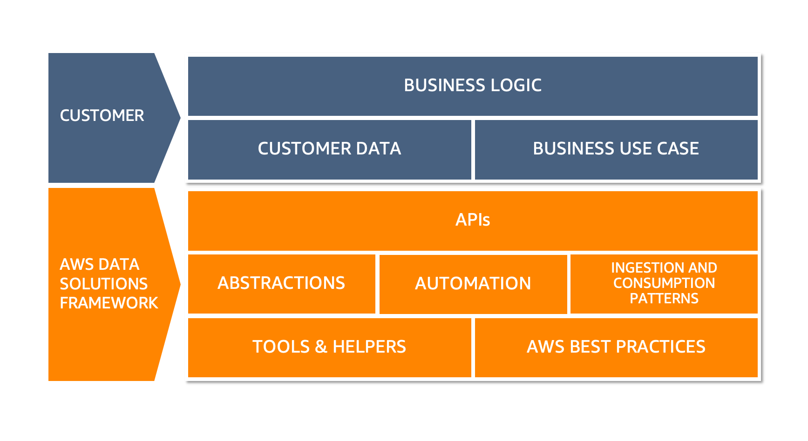

# Data solutions framework on AWS 

DSF on AWS is an open-source framework that simplifies implementation and delivery of integrated, customizable, and ready-to-deploy solutions that address the most common data analytics requirements. 

DSF on AWS uses infrastructure as code and [AWS CDK](https://aws.amazon.com/cdk/) to package AWS products together into easy-to-use solutions. It provides an abstraction atop AWS services based on AWS CDK L3 [constructs](https://docs.aws.amazon.com/cdk/v2/guide/constructs.html). 
L3 Constructs are opinionated implementations of common technical patterns and generally create multiple resources that are configured to work with each other. For example, we provide a construct that creates a complete data lake storage with three different Amazon S3 buckets, encryption, data lifecycle policies, and etc. 
This means that you can create a data lake with in your CDK application with just a few lines of code. 

Constructs are written in Typescript but available in both Typescript (on NPM) and Python (on PyPi).

The AWS CDK L3 constructs in DSF on AWS are built following these tenets:
* They simplify the use of AWS services in common situations via configuration helpers and smart defaults.
* Even if they provide smart defaults, you can customize them using the construct parameters to better fit your requirements.
* If customizing the parameters is not enough, CDK composability allows you to build your own abstractions by composing lower-level constructs.
* They are [well architected](https://aws.amazon.com/fr/architecture/well-architected/?wa-lens-whitepapers.sort-by=item.additionalFields.sortDate&wa-lens-whitepapers.sort-order=desc&wa-guidance-whitepapers.sort-by=item.additionalFields.sortDate&wa-guidance-whitepapers.sort-order=desc). We use [CDK-nag](https://github.com/cdklabs/cdk-nag) and the [AWS Solutions rules](https://github.com/cdklabs/cdk-nag/blob/main/RULES.md#awssolutions) in the vetting process.

You can use DSF on AWS to accelerate building your analytics solutions, and/or you can use solutions that have been built with it.
