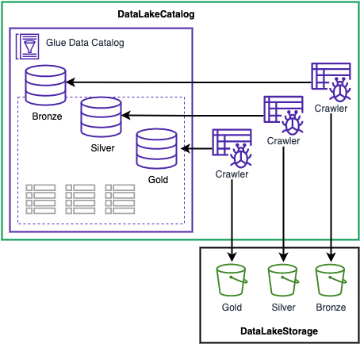

# DataLakeCatalog

AWS Glue Catalog databases on top of a DataLakeStorage.

## Overview

`DataLakeCatalog` is a data catalog for your data lake. It's a set of [AWS Glue Data Catalog Databases](https://docs.aws.amazon.com/glue/latest/dg/define-database.html) configured on top of a [`DataLakeStorage`](./data-lake-storage). 
The construct creates three databases pointing to the respective medallion layers (bronze, silve or gold) of the `DataLakeStorage`:
- The database default location is pointing to the corresponding S3 bucket location `s3://<locationBucket>/<locationPrefix>/`
- By default, each database has an active crawler scheduled to run once a day (00:01h local timezone). The crawler can be disabled and the schedule/frequency of the crawler can be modified with a cron expression.



:::caution Data Catalog encryption
The AWS Glue Data Catalog resources created by the `DataCatalogDatabase` construct are not encrypted because the encryption is only available at the catalog level. Changing the encryption at the catalog level has a wide impact on existing Glue resources and producers/consumers. Similarly, changing the encryption configuration at the catalog level after this construct is deployed can break all the resources created as part of AWS DSF.
:::caution

## Usage

```python
from aws_cdk import (
  App, 
  Stack, 
)
from aws_dsf import DataLakeCatalog

app = App()
stack = Stack(app, 'DataCatalogStack')

data_lake = DataLakeStorage(stack, 'ExampleDataLake')

DataLakeCatalog(stack, "DataLakeCatalog",
                data_lake_storage=data_lake)
```
## Modifying the crawlers behavior for the entire catalog

You can change the default configuration of the AWS Glue Crawlers associated with the different databases to match your requirements:
* Enable or disable the crawlers
* Change the crawlers run frequency
* Provide your own key to encrypt the crawlers logs

The parameters apply to the three databases, if you need fine-grained configuration per database, you can use the [DataCatalogDatabase](./data-catalog-database) construct. 

```python
my_key = Key(stack, 'CrawlerLogsKey')

data_lake = DataLakeStorage(stack, 'ExampleDataLake')

DataLakeCatalog(stack, 'ExampleDatabase',
                data_lake_storage=data_lake,
                auto_crawl=True,
                auto_crawl_schedule='cron(1 0 * * ? *)',
                crawler_log_encryption_key=my_key)
```
