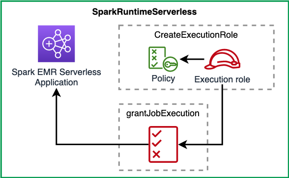

# Spark EMR Serverless Runtime

A construct to create a [Spark EMR Serverless Application](https://docs.aws.amazon.com/emr/latest/EMR-Serverless-UserGuide/getting-started.html), along with methods to grant a principal (ie. IAM Role or IAM User) the right to start an EMR Serverless job as well as method to create an IAM execution that is assumed by EMR Serverless to execute job. 

## Overview

The construct provides a method to create a Spark EMR Serverless Application, with the latest EMR runtime as the default runtime. You can change the runtime by passing your own as a `Resource property` to construct initializer.

The construct creates by default a VPC that is used by EMR Serverless Application. The VPC has the following CIDR range `10.0.0.0/16` and comes with an S3 VPC Endpoint Gateway attached to it. The construct creates also a security group for the EMR Serverless Application. You can override this by defining your own `NetworkConfiguration` as defined in the `Resource properties` of the construct initializer.

The construct has the following interfaces:

   * A construct Initializer that takes an object as `Resource properties` to modify the default properties. The properties are defined in `SparkEmrServerlessRuntimeProps` interface.
   * A method to create an execution role for EMR Serverless. The execution role is scoped down to the EMR Serverless Application ARN created by the construct.
   * A a method that take an IAM role to call the `StartJobRun` and monitor the status of the job.
      * The IAM policies attached to the provided IAM role is as follow:
      * The role has a `PassRole` permission scoped as follow:

The construct has the following attributes:

   * applicationArn: The ARN EMR Serverless Application
   * applicationId: The Id EMR Serverless Application
   * vpc: the VPC created if none is provided
   * emrApplicationSecurityGroup: the security created along the VPC
   * s3GatewayVpcEndpoint: The vpc endpoint attached to the vpc created

The screenshot a representation of the construct responsibilities.



## Usage

The code snipet below shows a usage exampe of the SparkEmrServerlessRuntime construct.

```python

from aws_cdk import core
from adsf import SparkRuntimeServerless
from aws_cdk.aws_iam import PolicyStatement, Role, PolicyDocument

runtime_serverless = SparkEmrServerlessRuntime(
    stack, 'SparkRuntimeServerless',
    name='spark-serverless-demo'
)

s3_read_policy = PolicyDocument(
    statements=[
        PolicyStatement(
            actions=['s3:GetObject'],
            resources=['S3-BUCKET'],
        )
    ]
)

# The IAM role that will trigger the Job start and will monitor it
job_trigger = Role(
    stack, 'EMRServerlessExecutionRole',
    assumed_by=IAM_PRINCIPAL,
)

my_execution_role = runtime_serverless.create_execution_role(
    'execRole1', s3_read_policy
)


runtime_serverless.grant_job_execution(job_trigger, my_execution_role.role_arn)

core.CfnOutput(
    stack, 'SparkRuntimeServerlessStackApplicationArn',
    value=runtime_serverless.application_arn,
)

```
